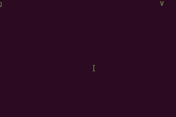

# MyQEE 服务器


### 介绍

MyQEE V2服务器是在Swoole V4协程基础之上开发的全面协程化的服务器组件，独创的协程Shuttle穿梭理念是最大的亮点，即适合web项目也适合长连接服务，更是大型高并发项目的福音。

### Shuttle - 穿梭

旨在提高对复杂数据流处理业务的编程体验，降低编程人员对业务处理程序理解难度，利用协程的特点让程序在不同的数据处理序列里不断的穿梭。

想像一下，一个消息队列服务器集群，里有成千上万个“消息队列”，每个队列有一个消费者专门处理数据然后把处理结果返回给生产者，这样的一个消息队列集群应该是比较容易理解的，如下图一样数据在并行被处理，它既是并发的又保证了队列数据处理的顺序。



穿梭理念就是将一个进程想像成一个“消息队列集群”，你将各种function、数据处理等当做一个个的消息队列，创建出各种Shuttle服务，每一个Shuttle就是一个具备一对Input/Output的处理功能的队列，或大或小相互调用，因为是协程化的服务，所以数据处理就在不同的“消息队列”里不断的穿梭执行，所以，Shuttle就是一个非常奇妙的理念，它即可以让你的程序无感知的协程化又可以保证数据和功能处理的逻辑顺序。

### V1和V2的差别

* V1 基于 Swoole v1.0及v2.0版本，使用传统的同步+异步方式
* V2 基于 Swoole v4 的协程版本，全面协程化


### 协程入门

为什么要用协程？协程的最大好处就是可以自己控制程序出让（暂停）和唤醒（继续执行），而传统同步代码要么不执行要么就要一次性运行到结束，中间不可以穿插别的事情。

举一个形象的例子：各种大小不一的汽车过关卡对所有人员进行安全检查。
每个人相当于一个小程序块，一个汽车相当于一个大程序块，过安检相当于运行程序。

传统的做法：汽车到关卡安检员上车每个人检查完放行检查下一辆，如果一辆车人较多后车等待的时间就长。协程的做法却不是这样，而是汽车到达关卡后安检员检查一个人后就去下一辆车，直到这个车全部安检完毕放行（即执行完毕）。<br>
在安检时可能情况会很多，比如安检某个人时此人说箱子的钥匙放在了另外一个车上（比如mysql数据、另外一个function），那么安检员就让这个人等一下他就继续安检下一个人了（同步代码则要一直等拿来钥匙），待那辆车来了后安检员再叫那个等待的人过来继续给他检查（协程调度）<br>
协程里也可以执行纯同步的代码，就好比检查到一辆车的司机素质不好非要他将一车人都检查完（不用协程），那么安检员就只好一个个的人检查然后放行汽车。

这样看来，协程的“安检员”对人员的检查顺序就是完全“随机”的，可能上一秒还是检查这个车下一秒就检查刚刚才到的车了，这样带来几个好处和一些问题：

* 好处是：安检员不用在那空等了，相同时间检查的人更多了，提高了效率<br>
* 问题是：会额外增加一些时间和资源（需要记录挂起的协程的数据），如果一个人被遗忘了这个车就永久被遗忘在安检处，最终可能会塞满服务器，所以需要注意避免这样的问题。另外就是安检顺序变得完全随机，这个带来的后果也许很麻烦，如果你在完全协程的代码里更新同一个数据最终结果可能变得非常不确定，因为他们是依靠调度执行的，真正的顺序可能和预期不一致。

MyQEE的Shuttle就是用来解决这些问题的，它即可以自动实现程序协程化又可以确保相同操作的顺序一致。

但需要注意的是：

* Swoole的协程不可以像go那样利用多线程实现多核利用，它只能使用当前进程资源，最多使用当前进程所在cpu到达单核100%。
* 非网络IO的协程代码块只可调整执行先后顺序不可能缩短总执行时间，比如你有2个协程块分别是算1+1的，不管谁先执行总时间是不会变短的，但是如果2个协程里1个是1+1运算(用时`$a`)，另外一个是依靠网络请求另外一个服务器实现1+1结果（用时`$b`），这时总时间就是 `max($a, $b)` 了。


### 快速使用

请使用 `composer` 进行安装（无需手动下载MyQEE服务器代码，see https://getcomposer.org/doc/00-intro.md or http://docs.phpcomposer.com/00-intro.html）

1.新建一个文件夹，并创建 `composer.json` 文件，内容如下：

```json
{
    "name": "TestServer",
    "description": "test",
    "config": {
        "bin-dir": "bin",
        "data-dir": "data"
    },
    "autoload": {
        "psr-0": {
            "": "classes/"
        }
    },
    "require": {
        "myqee/server": "~1.0"
    },
    "require-dev": {
        "myqee/server": "dev-master"
    }
}
```

2.创建文件 `classes/WorkerMain.php`，内容如下：

```php
<?php
# Http的工作进程对象
class WorkerMain extendsMyQEE\Server\WorkerHttp
{
    public function onRequest($request, $response)
    {
        $response->end('hello world');
        
        # 投递一个任务给任务进程异步执行
        $this->task('hello');
    }
}
```

3.创建文件 `classes/WorkerTask.php`，内容如下：

```php
# 异步任务进程对象
class WorkerTask extends MyQEE\Server\WorkerTask
{
    public function onTask($server, $taskId, $fromId, $data, $fromServerId = -1)
    {
        echo 'onTask = ';
        var_dump($data);
    }
}
```

4.在 `bin/` 目录中创建 `server` 文件，并执行 `chmod +x bin/server` 内容如下：

```
#!/usr/bin/env php
<?php
require __DIR__ .'/../vendor/autoload.php';
use MyQEE\Server\Server;
$server = new Server(__DIR__ .'/server.yal');
$server->start();
```

5.在 `bin/` 中创建 `server.yal` 文件(详细配置见本代码库的 `example/server-full.yal` 文件)，内容：

```
---
hosts:
  # 服务1，http 类型，监听端口 9000
  Main:
    type: http
    host: 0.0.0.0
    port: 9001
    listen:
      - tcp://0.0.0.0:9010   # 再额外监听一个 9010 端口
    name: MQSRV               # 会输出 Server: MQSRV 的头信息
    # class: WorkerHttpTest   # 自定义抽象化的类名称

  # 自定义端口
  Test:
    type: tcp
    host: 127.0.0.1
    port: 2200
    conf:
      # 端口监听参数设置 see http://wiki.swoole.com/wiki/page/526.html
      open_eof_check: true
      open_eof_split: true
      package_eof: "\n"

  # WebSocket、多端口服务见完整的配置例子

# 异步任务进程配置
task:
  # 任务进程数，2 个只是测试，请根据实际情况调整
  number: 2
  class: WorkerTask

# php 相关配置
php:
  error_reporting: 7
  timezone: PRC
```

然后执行 `composer install` 安装服务器类库，此时你可以看到 `bin/example/` 目录下有 `server` 和 `server-lite.yal` 文件。执行 `./bin/example/server` 启动服务，打开浏览器访问 `http://127.0.0.1:9001/`。

**实际开发时建议将 `server` 和 `server-lite.yal` 文件复制到bin目录后自行修改。**

### 自定义服务器配置

在 `bin/example/` 目录下，有 `server-lite.yal` 和 `server-full.yal` 配置样例文件，lite 文件是比较简洁的常用配置文件，参照使用即可；full 文件是完整的配置，适合深度配置。

一般情况下，只需要根据自己的服务器定义好 hosts 里的服务器配置就可以了（类型、监听端口）非常简单，然后再实现对应的类的方法。


#### 错误解决

 * 如果网络很慢或被墙，可执行 `composer config -g repo.packagist composer https://packagist.phpcomposer.com` 使用国内的镜像；

### 程序依赖

PHP 扩展：Swoole (>=4.2.12), Yaml。

### 安装PHP

php推荐使用 REMI 源，[http://mirror.innosol.asia/remi/](http://mirror.innosol.asia/remi/)。

CentOS 7/RHEL/Scientific Linux 7 x86_64 安装：
```
yum install https://mirrors4.tuna.tsinghua.edu.cn/remi/enterprise/remi-release-7.rpm
```
CentOS 6/RHEL/Scientific Linux 6 i386 or x86_64安装：
```
yum install https://mirrors4.tuna.tsinghua.edu.cn/remi/enterprise/remi-release-7.rpm
```

安装成功后，修改 `vim /etc/yum.repos.d/remi-php72.repo` 文件，将
`[remi-php72]`标签下的 `enabled=0` 改成 `enabled=1`，这样就默认用php7了(要启用 php7.1 则修改 `remi-php71.repo` 文件)。

然后执行
```bash
yum install php php-swoole php-yaml php-msgpack
```
即可。

更多的安装方法见：[Install PHP 7 on Linux](http://www.2daygeek.com/install-php-7-on-ubuntu-centos-debian-fedora-mint-rhel-opensuse/)


### 基本对象

类名称                                        |  说明
---------------------------------------------|--------------------
`\MyQEE\Server\Server`                       | 服务器对象
`\MyQEE\Server\ServerRedis`                  | 支持Redis协议服务器对象
`\MyQEE\Server\Worker`                       | 工作进程基础对象
`\MyQEE\Server\Worker\ProcessTask`           | 任务进程基础对象
`\MyQEE\Server\Worker\ProcessCustom`         | 托管在Manager里和Worker、Task平级的独立的自定义子进程基础对象
`\MyQEE\Server\Worker\ProcessLogger`         | 独立写log的进程的处理对象
`\MyQEE\Server\Worker\SchemeHttp`            | Http协议的进程基础对象
`\MyQEE\Server\Worker\SchemeTCP`             | 自定义TCP协议的进程基础对象
`\MyQEE\Server\Worker\SchemeUDP`             | 自定义UDP协议的进程基础对象
`\MyQEE\Server\Worker\SchemeAPI`             | API类型的进程基础对象
`\MyQEE\Server\Worker\SchemeWebSocket`       | 支持WebSocket协议的进程基础对象
`\MyQEE\Server\Worker\SchemeManager`         | 管理后台类型的进程基础对象
`\MyQEE\Server\Worker\SchemeRedis`           | 支持Redis协议的进程基础对象
`\MyQEE\Server\Worker\SchemeHttpRangeUpload` | 支持断点续传、分片上传的大文件上传服务器对象
`\MyQEE\Server\Worker\SchemeSocketIO`        | 支持HSocketIO服务器协议的对象
`\MyQEE\Server\Worker\SchemeHprose`          | 支持Hprose的RPC服务器对象
`\MyQEE\Server\Action`                       | 一个简单好用的类似控制器的Http请求动作对象基础类
`\MyQEE\Server\Message`                      | 可以用于进程间通信的数据对象
`\MyQEE\Server\Shuttle`                      | 协程穿梭服务
`\MyQEE\Server\ShuttleJob`                   | 协程穿梭服务任务对象
`\MyQEE\Server\Dao`                          | 数据映射为对象的基础对象

### 如何使用

一个传统的 Swoole 包括：

* Reactor线程，它是真正处理TCP连接，收发数据的线程；
* Manager进程，管理Swoole内部的进程，这个一般不需要关心；
* Worker进程，它接受 Reactor 线程投递的请求数据包，是真正php业务处理的进程；
* Task进程，接受 Worker 进程投递的任务，通常用于辅助Worker进程处理耗时的或需要异步处理的数据任务；

详细的说明见：http://wiki.swoole.com/wiki/page/163.html

我们一般开发 Swoole 服务器只需要实现 Worker 进程相关业务逻辑即可，复杂一些的服务器可以用 Task 进程来进行配合使用。为了优化代码结构，MyQEE 服务器类库里为每一个监听的端口分配了一个 Worker 对象，一般情况下你只需要关心 `WorkerMain` 和 `WorkerTask` 的相关代码实现即可。

#### Worker进程
你需要创建一个 `WorkerMain` 的类(可以自定义类名称，见 `bin/example/server-full.yal` 文件配置样例)，然后根据你服务的特性选择继承到对应的类上面，选择的方式如下：

* 如果不需要任何 http、websocket 相关服务，TCP的继承到 `\MyQEE\Server\Worker\SchemeTCP` 并实现 `onReceive` 方法，UDP服务继承到 `\MyQEE\Server\Worker\SchemeUDP` 类，并实现 `onPacket` 方法；
* 如果需要 Http 但不需要 WebSocket，则继承 `\MyQEE\Server\Worker\SchemeHttp` 类，实现 `onRequest` 方法，这个方法系统默认已经提供，使用方法详见下面 Http 使用部分；
* 如果你的服务需要 WebSocket，则继承 `\MyQEE\Server\Worker\SchemeWebSocket` 类，实现 `onMessage` 方法，也可以实现 `onOpen` 方法；
* 如果服务即需要 Http 也需要 WebSocket，仍旧是继承 `\MyQEE\Server\Worker\SchemeWebSocket`，同时实现即可；
* 如果需要大文件上传服务器，则继承 `\MyQEE\Server\Worker\SchemeHttpRangeUpload`，它具备 `\MyQEE\Server\Worker\SchemeHttp` 所有功能，特有 `checkAllow($request)` 方法你可以自行实现，它在收到POST头信息时就会调用（不需要等到文件上传完毕），返回 `false` 则立即断开服务禁止上传文件，全部文件上传完毕后会调用 `onRequest($request, $response)` 方法；

**注意：** 若使用 Http 或 WebSocket 需要在配置中将 `server.http.use` 设置成 `true`。

```php
<?php
class WorkerMain extends MyQEE\Server\Worker\SchemeHttp
{
    public function onRequest($request, $response)
    {
        $response->end('hello world');
    }
}
```
以上是代码样例

#### Task进程

Task进程是一个可以帮 Worker 进程异步处理数据的进程，你可以将比较耗时的数据投递给 task 去处理。

如果你需要使用 task 功能，你只需要创建一个 `WorkerTask` 的类，并继承到 `MyQEE\Server\WorkerTask` 上，然后实现 `function onTask($server, $task)` 方法即可，有数据投递时，系统会回调此方法。

```php
<?php
class WorkerTask extends MyQEE\Server\Worker\ProcessTask
{
    public function onTask($server, $task)
    {
        var_dump($task);
    }
}
```
以上是代码样例

#### Custom进程

自定义子进程并不是swoole内的概念，而是 MyQEE Server 特有的功能，它通常用于提供你自主的创建一个新的进程用于处理一些额外的任务（比如各种定时器任务、独立功能的任务等等）

它是利用Swoole的 `$server->addProces()` 方法在服务器启动时创建的用户自定义进程，和worker进程平级并且支持异步功能，并且当子进程异常退出时系统会自动重新创建。使用方法：

首先在配置中加入 

```yaml
customWorker:
  Test:
    name: myTest
    class: myTestClass
```

这样的配置，然后创建类文件 `myTestClass`，（其中 myTestClass 就是配置中定义的 class 的名称，支持命名空间形式）内容大致如下：

```php
<?php
class myTestClass extends \MyQEE\Server\Worker\ProcessCustom
{
    public function onStart()
    {
        # 创建一个定时器
        swoole_timer_tick(1000 * 10, function()
        {
            echo 'hello world';
        });
    }
}
```

这样在启动服务器时，系统就会自动创建一个很 worker 平级的子进程运行这个自定义的子进程。注意，创建的自定义子进程在调用 Swoole 的 `$server->reload()` 方法时是不会重新加载的，可以使用 MyQEE Server 的 `reload()` 方法或 `reloadCustomWorker()` 方法进程重新加载子进程


#### 多端口使用

配置选项中 `hosts` 项目可以任意添加多个，例如:

```yaml
hosts:
  # 服务1，http 类型，监听端口 9000
  Main:
    type: http
    host: 0.0.0.0
    port: 9001
    listen:
      - tcp://0.0.0.0:9010   # 再额外监听一个 9010 端口
    name: MQSRV               # 会输出 Server: MQSRV 的头信息
    # class: WorkerHttpTest   # 自定义抽象化的类名称

  # 自定义端口
  Test1:
    type: tcp
    host: 127.0.0.1
    port: 2200
    conf:
      # 端口监听参数设置 see http://wiki.swoole.com/wiki/page/526.html
      open_eof_check: true
      open_eof_split: true
      package_eof: "\n"
  Test2:
    link: tcp://0.0.0.0:1314
    class: MyTest2Worker
    conf:
      open_eof_check: true
      open_eof_split: true
      package_eof: "\n"
```

表示监听一个TCP端口服务，此时你需要创建一个 `WorkerTest` 对象并继承到 `\MyQEE\Server\WorkerTCP`，然后实现 `onReceive` 方法即可。

#### 入口文件
```php
<?php
class WorkerTest extends MyQEE\Server\Worker\SchemeTCP
{
    public function onReceive($server, $fd, $fromId, $data)
    {
        var_dump($data);
    }
}
```
以上是代码样例


以下是服务器的最基本的启动代码：

```php
#!/usr/bin/env php
<?php
require __DIR__ .'/../vendor/autoload.php';

use MyQEE\Server\Server;

$server = new Server(__DIR__ .'/server.yal');

$server->start();
```


### 高级使用

#### API控制器的使用

`MyQEE\Server\WorkerAPI` 实现了一个简单好用的 Action 的调度（类似于一个简单的控制器逻辑），默认使用根目录下 api 目录，你可以创建一个 test.php 内容如下：

```php
<?php
return function($request, $response)
{
    /**
     * @var \Swoole\Http\Request $request
     * @var \Swoole\Http\Response $response
     */
    print_r($request);
    
    return "hello world, now is: ". time();
};
```

启动服务器后，你就可以在访问 `http://127.0.0.1:8080/api/test` 了，其中 8080 是你监听的端口。得到的内容如下：

```
HTTP/1.1 200 OK
Server: MQSRV
Content-Type: application/json
Connection: keep-alive
Date: Thu, 04 May 2017 06:33:22 GMT
Content-Length: 61

{"data":"hello world, now is: 1493879602","status":"success"}
```

#### 支持集成 Hprose RPC服务端

需要安装 `hprose/hprose`, `hprose/hprose-swoole`，安装方法：

```bash
composer require hprose/hprose:dev-master hprose/hprose-swoole:dev-master
``` 

支持 tcp、http、webSocket 协议服务端，使用方法同普通的Worker，取代了 Hprose 官网提供的swoole-server版本，事件支持相同，见
[Hprose服务器事件](https://github.com/hprose/hprose-php/wiki/07-Hprose-%E6%9C%8D%E5%8A%A1%E5%99%A8%E4%BA%8B%E4%BB%B6)

如果要扩展 `onBeforeInvoke` 方法，只需要在 `WorkerHprose` 里扩展 `onBeforeInvoke` 方法即可。 


### Event事件的使用

在 worker 对象中会自动创建一个 `MyQEE\Server\Event` 对象，可以通过 `$worker->event` 获取对象。使用方法：

```php
# 绑定
$worker->event->on('test', function() 
{
    echo "test\n";
});

# 触发
$worker->event->trigger('test');
```

### 常见问题

* 问：MyQEE 服务器类库提供了这么多功能，性能是否会有损失？<br>答：和你自己写的原生服务器差不多，几乎不会有什么性能损失；
* 问：使用 MyQEE 开发的服务再提供给别人使用，但是不希望有那么多配置，如何精简处理？<br>答：你可以自己写一个类继承到 `MyQEE\Server\Server` 上，然后把一些不怎么用的配置写到自己类里面，把最终的配置用数组（`$config`）传给 `parent::__construct($config)` 就可以；
* 问：WorkerAPI 的路径必须 /api/ 开头，如何可以从根目录开始？<br>答：你可以在对应的 Hosts 参数里加一个 prefix 的参数值为 / 即可，也可以自己实现一个 Worker 对象继承到 `MyQEE\Server\WorkerAPI` 上并覆盖默认值 `$prefix`


### License

Apache License Version 2.0 see http://www.apache.org/licenses/LICENSE-2.0.html

